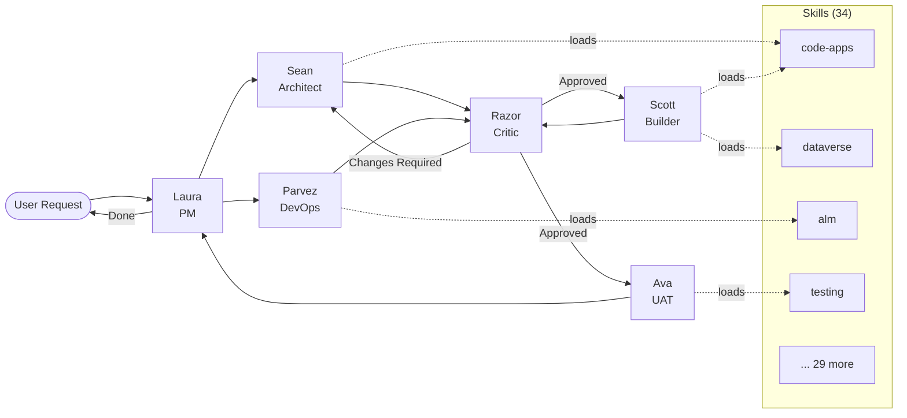

# Agent Team Orchestration Guide

How the 6 Power Platform agents coordinate to deliver quality work. Use this as a reference when running multi-step projects or when you're unsure which agent should act next.

---

## The Team

| Agent | Name | Role | Core Files |
|---|---|---|---|
| **Project Manager** | Laura | Requirements, planning, orchestration, spec-driven dev | `agents/laura.agent.md` |
| **Solutions Architect** | Sean | Design, architecture, ALM strategy | `agents/sean.agent.md` |
| **Power Platform Builder** | Scott | Implementation — Code Apps, Canvas, MDA, flows, PCF, plugins, etc. | `agents/scott.agent.md` |
| **Critic** | Razor | Review, quality assurance, severity-rated findings | `agents/razor.agent.md` |
| **DevOps / Platform Engineer** | Parvez | Environments, CI/CD, service principals, governance infrastructure | `agents/parvez.agent.md` |
| **UAT Coordinator** | Ava | UAT scripts, test cycles, defect tracking, sign-off | `agents/ava.agent.md` |

### Visual Overview



---

## Workflow Patterns

### Standard Feature Development

The default flow for any non-trivial feature. Every step has a clear owner.

```
User Request
    │
    ▼
┌──────────────┐
│  LAURA       │  1. Gather requirements
│  (PM)        │  2. Define acceptance criteria (Given/When/Then)
│              │  3. Create work breakdown
│              │  4. Identify which agents + skills are needed
└──────┬───────┘
       │
       ▼
┌──────────────┐  ┌──────────────┐
│  SEAN        │  │  PARVEZ      │  ← Run in PARALLEL
│  (Architect) │  │  (DevOps)    │
│              │  │              │
│  5. Design   │  │  8. Provision │
│     arch     │  │     environments
│  6. Data     │  │  9. Service   │
│     model    │  │     principals
│  7. ALM      │  │  10. CI/CD   │
│     strategy │  │     pipeline  │
└──────┬───────┘  └──────┬───────┘
       │                 │
       ▼                 ▼
       ├─────────────────┤
       ▼
┌──────────────┐
│  RAZOR       │  11. Review architecture
│  (Critic)    │  12. Review infrastructure setup
└──────┬───────┘
       │ (APPROVED or APPROVED WITH CONDITIONS)
       ▼
┌──────────────┐
│  SCOTT       │  13. Build solution components
│  (Builder)   │  14. Run self-review checklist
└──────┬───────┘
       │
       ▼
┌──────────────┐
│  RAZOR       │  15. Review implementation (architecture + accessibility + UX)
│  (Critic)    │  16. Issue verdict with severity ratings (S1-S4)
└──────┬───────┘
       │ (APPROVED)
       ▼
┌──────────────┐
│  AVA         │  17. Generate UAT scripts from acceptance criteria
│  (UAT)       │  18. Coordinate test cycle
│              │  19. Track defects -> route to Scott
│              │  20. Verify fixes -> confirm UAT sign-off
└──────┬───────┘
       │ (SIGNED OFF)
       ▼
┌──────────────┐
│  LAURA       │  21. Verify Definition of Done
│  (PM)        │  22. Present deliverable to user
│              │  23. Document follow-ups and tech debt
└──────────────┘
```

### Quick Fix / Bug Fix (Shortened)

```
User reports bug
    │
    ▼
LAURA → Clarify the bug, define what "fixed" looks like
    │
    ▼
SCOTT → Investigate, implement fix, self-review
    │
    ▼
RAZOR → Review fix (FOCUSED mode for small changes)
    │
    ▼
LAURA → Confirm fix meets criteria, present to user
```

### Architecture-Only

```
User asks "how should we build X?"
    │
    ▼
LAURA → Clarify requirements, constraints, goals
    │
    ▼
SEAN → Design architecture, produce ADR + diagrams
    │
    ▼
RAZOR → Review architecture, flag risks
    │
    ▼
LAURA → Present approved architecture to user
```

### Code Review Only

```
User asks "review this code"
    │
    ▼
RAZOR → FULL review: architecture + code + accessibility + ALM + UX
    │
    ▼
(If CHANGES REQUIRED) → SCOTT fixes, RAZOR re-reviews
    │
    ▼
(If APPROVED) → LAURA confirms, done
```

### Data Model Design

```
User needs a Dataverse schema
    │
    ▼
LAURA → Clarify entities, relationships, volumes, security needs
    │
    ▼
SEAN → Design schema (tables, columns, keys, ERD, security model)
    │      Load: dataverse, security, dataverse-web-api
    ▼
RAZOR → Review schema (alternate keys, cascade behaviors, permissions)
    │
    ▼
LAURA → Present approved schema to user
```

### Project Bootstrap (Greenfield)

```
User: "We need a new [project type] from scratch"
    │
    ▼
LAURA → 1. Gather requirements
      → 2. Define acceptance criteria
      → 3. Generate master specification (spec-driven-dev skill)
      → 4. Split into component specifications
    │
    ▼
SEAN (parallel with PARVEZ)
    SEAN → 5. Design architecture, 6. Data model, 7. ALM strategy
    PARVEZ → 8. Provision environments, 9. Service principals, 10. CI/CD pipeline
    │
    ▼
RAZOR → 11. Review architecture + infrastructure
    │ (APPROVED)
    ▼
SCOTT → 12. Create publisher + solution (Web API)
      → 13. Build tables/columns/relationships (dependency order)
      → 14. Build views/forms/app module/sitemap
      → 15. Build flows/plugins/web resources
      → 16. PublishAllXml + self-review
    │
    ▼
RAZOR → 17. Review implementation (FULL mode)
    │ (APPROVED)
    ▼
AVA → 18. Generate UAT scripts, 19. Coordinate testing, 20. Track defects, 21. UAT sign-off
    │ (SIGNED OFF)
    ▼
LAURA → 22. Verify Definition of Done, 23. Present deliverable, 24. Document follow-ups
```

### Spec-Driven Build

```
User: "Build [complex feature] for our solution"
    │
    ▼
LAURA → 1. Gather requirements
      → 2. Load spec-driven-dev skill
      → 3. Generate master specification
      → 4. Split into component specs (spec-tables, spec-views-forms, spec-flows, etc.)
    │
    ▼
SEAN → 5. Review and refine component specs
     → 6. Identify dependency order and parallel work
     → 7. Produce dependency graph
    │
    ▼
SCOTT → 8. Build by dependency order:
         Phase 1: Publisher + Solution
         Phase 2: Tables + columns + relationships
         Phase 3: Views + forms (can batch)
         Phase 4: App module + sitemap
         Phase 5: Independent components (PARALLEL)
         Phase 6: Flows (after tables/plugins exist)
         Phase 7: PublishAllXml
    │
    ▼
RAZOR → 9. Review each phase as it completes
      → 10. Issue phase-level verdicts
```

### Infrastructure Setup

```
User: "Set up environments and CI/CD for our project"
    │
    ▼
LAURA → Clarify topology requirements (how many environments, team size)
    │
    ▼
SEAN → Design environment topology and ALM strategy
    │
    ▼
PARVEZ → 1. Provision environments (dev/test/prod)
       → 2. Create service principals
       → 3. Set up Key Vault
       → 4. Configure CI/CD pipeline
       → 5. Enable Managed Environments
       → 6. Configure DLP policies
       → 7. Set up Application Insights
       → 8. Document infrastructure
    │
    ▼
RAZOR → Review infrastructure setup
    │ (APPROVED)
    ▼
PARVEZ → Hand off to Scott with "Platform Ready" confirmation
```

### MCP-Driven Development (AI-Assisted Full Loop)

For teams using MCP servers (Dataverse MCP, Azure DevOps MCP, PAC CLI MCP), the full development loop can be AI-assisted end-to-end:

```
User: "Build the feature from work item #1234"
    │
    ▼
LAURA → 1. Read requirement from ADO work item (via ADO MCP)
    │
    ▼
SEAN  → 2. Discover schema via Dataverse MCP, architect solution
    │
    ▼
RAZOR → 3. Review architecture (multi-model: send README to second model for critique)
    │
    ▼
SCOTT → 4. Build via Dataverse MCP (create columns) + PAC CLI (export/modify/import solution)
    │
    ▼
AVA   → 5. Generate Playwright tests from acceptance criteria, run via `pac test run`
    │
    ▼
RAZOR → 6. Review code + verify test coverage
    │
    ▼
AVA   → 7. Post test results to ADO work item (via ADO MCP), mark task done
```

**MCP servers used:**
| Server | Role in Workflow | Status |
|---|---|---|
| Azure DevOps MCP | Read work items, post test results, update task state | Local GA, Remote Preview |
| Dataverse MCP | Schema discovery, record CRUD, validate live data | GA (metered) |
| PAC CLI MCP | Solution export/import, `pac test run`, environment management | GA |

**Key insight (from Sean Astrakhan):** AI should help you *think* about solutions, not just *execute* them. Use MCP-driven discovery to explore options (formula columns vs plugins vs JavaScript), then let the agent architecture (Sean → Razor review → Scott build) ensure quality.

---

## When to Engage Each Agent

### Laura (Project Manager)

**Always first.** Every request starts with Laura to ensure clarity before work begins.

| Trigger | Example |
|---|---|
| New feature request | "Build me an order management app" |
| Vague or incomplete requirements | "I need something for tracking contacts" |
| Multi-step coordination | "Set up CI/CD and build the app" |
| Prioritization | "What should we do next?" |
| Status check | "Where are we on the project?" |

**Laura does NOT**: write code, design schemas, make architecture decisions, or implement fixes.

### Sean (Solutions Architect)

**Before any code is written.** Design decisions must be explicit, not made implicitly during coding.

| Trigger | Example |
|---|---|
| App type decision | "Should this be a Code App or Canvas App?" |
| Data model design | "Design the schema for orders and line items" |
| Architecture design | "How should we structure this solution?" |
| Integration patterns | "How do we connect to the external API?" |
| ALM strategy | "How should we deploy this across environments?" |
| Security model | "Who can see what data?" |

**Sean does NOT**: write production code, run CLI commands, or implement designs.

### Scott (Power Platform Builder)

**Only after architecture is approved.** Never starts building without a design from Sean. Loads the relevant skill for whatever component type is being built.

| Trigger | Example |
|---|---|
| Code App | "Build the contact list component" |
| Canvas App | "Create the inspection Canvas App" |
| Model-Driven App | "Configure the case management form" |
| Power Automate | "Set up the approval flow" |
| PCF Control | "Build a star-rating PCF control" |
| Plugin | "Write a plugin to auto-number records" |
| Dataverse schema | "Create the tables for project tracking" |
| Web resource | "Add form script to hide the tab" |
| Power Pages | "Build the self-service portal" |
| ALM pipeline | "Set up the GitHub Actions CI/CD" |
| Bug fix | "Fix the search not returning results" |

**Scott does NOT**: make architecture decisions, change approved data models, or skip the self-review checklist.

### Razor (Critic)

**After every significant deliverable.** Both architecture and code get reviewed.

| Trigger | Example |
|---|---|
| Architecture review | "Is this design solid?" |
| Code review | "Review this component" |
| Accessibility audit | "Check WCAG compliance" |
| ALM review | "Can this be promoted to prod?" |
| Schema review | "Review the data model" |
| Flow review | "Check this Power Automate flow" |

**Razor does NOT**: implement fixes, design architecture, or gather requirements.

### Parvez (DevOps / Platform Engineer)

**For infrastructure and platform setup.** Environments, pipelines, service principals, governance.

| Trigger | Example |
|---|---|
| Environment provisioning | "Set up dev, test, and prod environments" |
| Service principal setup | "Configure service principal for CI/CD" |
| CI/CD pipeline | "Set up GitHub Actions for solution deployment" |
| Key Vault configuration | "Set up Azure Key Vault for secrets" |
| CoE Starter Kit | "Install and configure CoE Starter Kit" |
| Managed Environments | "Enable Managed Environments on our target environments" |
| Git integration | "Set up Git integration for our solution" |
| Azure CLI auth | "Set up Azure CLI authentication for Web API access" |

**Parvez does NOT**: build apps, design schemas, write business logic, or gather requirements.

### Ava (UAT Coordinator)

**After Scott builds, before production.** Bridges Laura's acceptance criteria and Scott's implementation.

| Trigger | Example |
|---|---|
| UAT script generation | "Write test scripts for the contact management feature" |
| Test cycle coordination | "Coordinate UAT for the new order app" |
| Defect tracking | "Track the issues found during testing" |
| UAT sign-off | "Compile test results and get sign-off" |
| Demo preparation | "Prepare a demo script for the stakeholder meeting" |
| User training | "Write a quick reference guide for end users" |

**Ava does NOT**: write code, design architecture, or implement fixes.

### Razor Review Modes

| Mode | Scope | When to Use |
|---|---|---|
| **FULL** | Architecture + Code + Accessibility + ALM + UX | New features, major changes, pre-deployment |
| **FOCUSED** | Code + Accessibility only | Small features, refactors, bug fixes |
| **QUICK** | Single specific area | Targeted review, re-review after fixes |

### Razor Severity Ratings

| Severity | Meaning | Action |
|---|---|---|
| **S1 — CRITICAL** | Breaks in prod, security risk, blocks a11y | Must fix before deployment |
| **S2 — HIGH** | Problems at scale, WCAG AA violation, significant debt | Should fix before deployment |
| **S3 — MEDIUM** | Deviates from best practice, maintainability concern | Fix in current sprint |
| **S4 — LOW** | Cosmetic, naming, minor improvement | Fix when convenient |

### Razor Verdicts

| Verdict | Meaning |
|---|---|
| **APPROVED** | No S1/S2 findings. Ship it. |
| **APPROVED WITH CONDITIONS** | S3/S4 only. Ship, but fix the noted items. |
| **CHANGES REQUIRED** | S1 or S2 findings. Fix, then re-review. |
| **REJECTED** | Fundamental approach is wrong. Needs redesign. |

---

## Skills Catalog

34 skills provide deep reference material. Skills marked ★ use a **router pattern** — the SKILL.md is a lightweight index linking to topic sub-files in the same directory. When loading a router skill, read SKILL.md first, then load only the relevant sub-file(s) for the task.

23 of 34 skills use the router pattern.

### Full Catalog

| Skill | Path | Router? | Sub-files |
|---|---|---|---|
| Code Apps | `skills/code-apps/SKILL.md` | ★ | architecture, cli-workflow, state-management, forms, fluent-ui, power-automate-integration, performance |
| Canvas Apps | `skills/canvas-apps/SKILL.md` | ★ | power-fx, delegation, components, screens-responsive, offline, connectors-integration, canvas-alm, performance |
| Model-Driven Apps | `skills/model-driven-apps/SKILL.md` | ★ | forms, views, sitemap, business-rules, command-bar, custom-pages, generative-pages |
| PCF Controls | `skills/pcf/SKILL.md` | | |
| Web Resources | `skills/web-resources/SKILL.md` | ★ | form-scripts, ribbon-commands, xrm-client-api, html-dashboards |
| Dataverse | `skills/dataverse/SKILL.md` | ★ | table-design, relationships, query-patterns, elastic-virtual-tables, naming-conventions |
| Dataverse Web API | `skills/dataverse-web-api/SKILL.md` | ★ | crud-queries, bulk-batch, metadata, customizations, files-change-tracking, solution-management, error-handling, auth-and-scripting, advanced-column-types, parallelization, dataverse-design-rules, formula-columns, grid-controls, business-rules-api, security-model-api, environment-variables-api, custom-apis |
| Dataverse MCP | `skills/dataverse-mcp/SKILL.md` | | |
| Security | `skills/security/SKILL.md` | ★ | roles-privileges, business-units-teams, row-column-security, web-api-management |
| Architecture | `skills/architecture/SKILL.md` | | |
| Power Automate | `skills/power-automate/SKILL.md` | ★ | error-handling, triggers, dataverse-actions, expressions, approvals-adaptive-cards, desktop-flows, agent-flows |
| Custom Connectors | `skills/custom-connectors/SKILL.md` | ★ | openapi-definition, authentication, triggers, policies-apim |
| Testing | `skills/testing/SKILL.md` | ★ | code-apps-testing, canvas-testing, plugin-testing, accessibility-testing, cicd-integration |
| ALM | `skills/alm/SKILL.md` | ★ | developer-inner-loop, git-integration, ado-pipelines |
| Accessibility & UX | `skills/accessibility-ux/SKILL.md` | ★ | wcag, react-patterns, ux-patterns, visual-design, component-recipes, responsive, a11y-testing |
| Plugins | `skills/plugins/SKILL.md` | ★ | setup-architecture, context-images, common-patterns, testing, registration-debugging, sandbox-performance |
| Power BI | `skills/power-bi/SKILL.md` | ★ | tmdl, dax, pbir, fabric-api, direct-lake, dataverse-source, embedded, cicd |
| Power Pages | `skills/power-pages/SKILL.md` | ★ | web-roles-permissions, liquid-templating, entity-lists-forms, authentication, javascript-webapi, code-sites, agent-api |
| Business Process Flows | `skills/business-process-flows/SKILL.md` | | |
| Dashboards | `skills/dashboards/SKILL.md` | | |
| Team Coordination | `skills/power-platform-team/SKILL.md` | | |
| Copilot Studio | `skills/copilot-studio/SKILL.md` | ★ | topics-authoring, knowledge-sources, mcp-integration, multi-agent-orchestration, autonomous-agents, channels-deployment, alm-governance-testing |
| AI Builder | `skills/ai-builder/SKILL.md` | ★ | document-processing, gpt-prompts, predictions |
| Spec-Driven Dev | `skills/spec-driven-dev/SKILL.md` | | |
| Governance | `skills/governance/SKILL.md` | ★ | dlp-policies, coe-starter-kit, tenant-admin, compliance-audit |
| Licensing | `skills/licensing/SKILL.md` | | |
| Environment Strategy | `skills/env-strategy/SKILL.md` | | |
| Observability | `skills/observability/SKILL.md` | ★ | app-insights-setup, mda-telemetry, canvas-telemetry, flow-telemetry, code-app-telemetry, alerting-dashboards |
| Azure OpenAI | `skills/azure-openai/SKILL.md` | ★ | power-automate-ai, code-apps-ai, copilot-studio-byom, ai-architecture-decisions |
| Integration Patterns | `skills/integration-patterns/SKILL.md` | ★ | service-bus, azure-functions, webhooks-events, hybrid-connectivity |
| M365 Integration | `skills/m365-integration/SKILL.md` | ★ | teams-integration, sharepoint-integration, graph-api, outlook-integration |
| Data Migration | `skills/data-migration/SKILL.md` | | |
| Performance Optimisation | `skills/perf-optimise/SKILL.md` | | |
| Test Engine | `skills/test-engine/SKILL.md` | ★ | test-plans, canvas-testing, mda-testing, playwright-advanced, cicd-integration, portal-testing |

### Skills Loading Matrix (by Agent + Project Type)

| Project Type | Laura | Sean | Scott | Razor | Parvez | Ava |
|---|---|---|---|---|---|---|
| **Code App** | architecture, alm, security, spec-driven-dev | architecture, security, alm, code-apps, accessibility-ux, dataverse, licensing, azure-openai, integration-patterns, observability | code-apps, accessibility-ux, dataverse-web-api, testing, perf-optimise, observability | code-apps, accessibility-ux, testing, alm, perf-optimise, observability | alm, env-strategy, governance | testing, accessibility-ux, code-apps |
| **Canvas App** | architecture, alm, security, spec-driven-dev | architecture, security, alm, canvas-apps, accessibility-ux, dataverse, licensing | canvas-apps, accessibility-ux, dataverse, testing, perf-optimise | canvas-apps, accessibility-ux, testing, dataverse, perf-optimise | alm, env-strategy, governance | testing, accessibility-ux, canvas-apps |
| **Model-Driven App** | architecture, alm, security, spec-driven-dev | architecture, security, alm, model-driven-apps, dataverse, licensing | model-driven-apps, web-resources, dataverse-web-api, business-process-flows, dashboards, observability | model-driven-apps, web-resources, dataverse, observability | alm, env-strategy, governance | testing, model-driven-apps |
| **Power Automate** | architecture, alm, security | architecture, security, power-automate, dataverse, licensing, integration-patterns, azure-openai | power-automate, dataverse-web-api, integration-patterns, azure-openai | power-automate, dataverse, integration-patterns | alm, env-strategy | testing, power-automate |
| **Plugin** | architecture, alm | architecture, dataverse, licensing | plugins, dataverse, dataverse-web-api | plugins, testing, dataverse | alm | testing |
| **PCF Control** | architecture, alm | architecture, pcf, accessibility-ux, licensing | pcf, accessibility-ux, testing | pcf, accessibility-ux, testing | alm | testing, accessibility-ux |
| **Power Pages** | architecture, alm, security | architecture, security, power-pages, licensing, m365-integration | power-pages, dataverse-web-api, accessibility-ux, copilot-studio | power-pages, security, accessibility-ux | alm, env-strategy, governance | testing, power-pages |
| **Power BI** | architecture | architecture, power-bi, dataverse, licensing | power-bi, dataverse | power-bi | alm | — |
| **Custom Connector** | architecture, alm | architecture, custom-connectors, licensing | custom-connectors | custom-connectors | alm | — |
| **Full Solution** | architecture, alm, security, spec-driven-dev, licensing, governance | architecture, security, alm, dataverse, licensing, governance, observability, azure-openai, integration-patterns, m365-integration, data-migration, (+ component skills) | dataverse-web-api, perf-optimise, observability, copilot-studio, azure-openai, integration-patterns, m365-integration, data-migration, (+ component skills) | perf-optimise, observability, copilot-studio, azure-openai, integration-patterns, licensing, (all relevant component skills) | alm, env-strategy, governance | testing, (+ component skills) |
| **Greenfield Bootstrap** | architecture, alm, security, spec-driven-dev, governance, licensing | architecture, security, alm, dataverse, env-strategy, licensing | — (waits for architecture) | — (waits for build) | alm, env-strategy, governance, observability | — (waits for build) |
| **Copilot Studio** | architecture, alm, security, spec-driven-dev | architecture, copilot-studio, security, azure-openai, licensing | copilot-studio, power-automate, dataverse-web-api | copilot-studio, security, testing | alm, env-strategy, governance | testing, copilot-studio |
| **Data Migration** | architecture, spec-driven-dev | architecture, dataverse, data-migration, integration-patterns, licensing | data-migration, dataverse-web-api, power-automate | data-migration, dataverse | alm, env-strategy | testing |

> Scott handles implementation across all Power Platform component types. Load the matching skill for the component being built.
> Parvez handles infrastructure in parallel with Sean's architecture phase.
> Ava generates UAT scripts after Scott's build phase completes.

---

## Rules of Engagement

1. **Laura always goes first** — no work starts without requirements clarity
2. **Sean before Scott** — no coding without approved architecture
3. **Parvez in parallel with Sean** — infrastructure provisioning happens alongside architecture design
4. **Razor reviews everything significant** — architecture AND code AND infrastructure
5. **Agents stay in their lane** — Scott doesn't make architecture decisions, Sean doesn't write production code, Razor doesn't implement fixes, Parvez doesn't build apps, Ava doesn't write code
6. **ALM from day one** — every design considers environment promotion and managed solutions
7. **Accessibility is not optional** — WCAG 2.2 AA compliance is part of every design and code review, not a separate pass
8. **UX is built in, not bolted on** — loading, empty, error states and responsive design are core requirements
9. **Ava before production** — UAT sign-off is required before any production deployment
10. **Definition of Done is enforced** — Laura verifies before presenting to user
11. **User has final say** — agents advise, users decide

---

## Definition of Done

A task is only "done" when ALL of the following are true:

- [ ] Acceptance criteria are met (as defined during intake)
- [ ] Code compiles and runs without errors
- [ ] ALM is accounted for (solution-aware, environment variables, connection references)
- [ ] Razor has reviewed and approved (or findings addressed)
- [ ] No hardcoded environment-specific values
- [ ] Error handling is present for all external calls
- [ ] Accessibility requirements are met (WCAG 2.2 AA)
- [ ] UX states are complete (loading, error, empty)
- [ ] The user has confirmed the deliverable meets their needs

---

## Session Tracking

For multi-step workflows, maintain a session tracker. Update after each milestone.

```markdown
## Session: [Project Name]

### Decisions Made
| # | Decision | Rationale | Decided By |
|---|---|---|---|
| 1 | [decision] | [why] | [user/Sean/Scott] |

### Agent Handoffs
| # | From | To | Task | Status |
|---|---|---|---|---|
| 1 | Laura | Sean | Architecture design | Completed |
| 2 | Sean | Razor | Architecture review | In Progress |

### Open Questions
- [ ] [Question needing user input]

### Completed Deliverables
- [x] [Deliverable + Razor verdict]

### Technical Debt / Follow-Ups
- [ ] [Item to address later]
```

---

## Using in VS Code / GitHub Copilot

### As Custom Agents (Recommended)
The 6 agent files in `agents/` register as custom modes in the VS Code Copilot agent picker. Switch agents directly:

```
@laura Plan the implementation for an order management app
@sean Design the data model for orders and line items
@parvez Provision dev/test/prod environments and set up CI/CD
@scott Build the order list component with CRUD operations
@razor Review the architecture before we start building
@ava Generate UAT scripts from the acceptance criteria
```

### Skills Auto-Load
Skills are loaded automatically when Copilot detects matching keywords. For decomposed skills (★), the SKILL.md router loads first, then only the relevant sub-file(s) are loaded based on the task context.

### The Team Skill
The `power-platform-team` skill can be loaded to give any agent awareness of the full team, all 34 skills, and the orchestration patterns. It acts as the coordination layer.

### Example: Full Feature Workflow

```
1. @laura "I need a contact management app with search, CRUD, and export"
   → Laura gathers requirements, defines acceptance criteria, proposes plan

2. @sean "Design the architecture per Laura's requirements"
   → Sean produces ADR, ERD, project structure, ALM strategy

3. @parvez "Provision environments and set up CI/CD pipeline"
   → Parvez provisions dev/test/prod, configures service principals, sets up GitHub Actions
   (runs in PARALLEL with step 2)

4. @razor "Review Sean's architecture and Parvez's infrastructure"
   → Razor reviews, issues verdict (APPROVED / CHANGES REQUIRED)

5. @scott "Implement the contact list page"
   → Scott builds components, hooks, wires up data sources

6. @razor "Review Scott's implementation"
   → Razor reviews code + accessibility + UX, issues verdict

7. @ava "Generate UAT scripts and coordinate testing"
   → Ava writes test scripts from acceptance criteria, tracks defects

8. @laura "Verify the deliverable against acceptance criteria"
   → Laura confirms Definition of Done, presents to user
```
